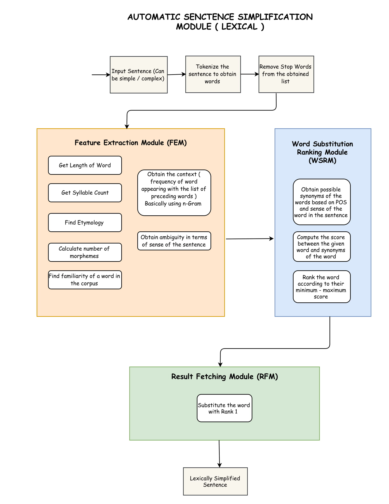
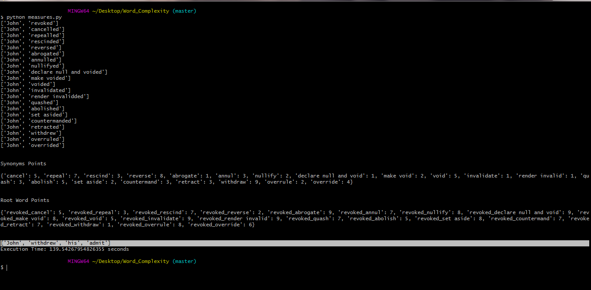

# Lexical Simplification (Feature Based Approach)

This project targets on the lexical simplification of a sentence based on the Feature Based Approach. Furthermore, the model used in this research project has been referred from **"SemEval-2012 Task 1: English Lexical Simplification" by Lucia Specia and Sujay Kumar Jauhar** Paper. 

## The Model

The model consists three modules which are: 
..* Feature Extraction Module *(FEM)*
..* Word Substitution Ranking Module *(WSRM)*
..* Result Fetching Module *(RFM)*



### Prerequisites

What things you need to install the software and how to install them

```
python 3.x
nltk
ast
bs4
urllib3
pyphen
strings
operator
pywsd
wiktionaryparser

```

### Installing

A step by step series of examples that tell you have to get a development env running

Say what the step will be

```
Install python 3.6 and ADD that to your PYTHONPATH
```

Install pip

```
Install the package manager for python by going at this link [Download pip](https://pip.pypa.io/en/stable/installing/).
```

Install nltk

```
pip install nltk
```

Install ast

```
pip install ast
```


Similarly, install all the prerequisites.

## Feature Extraction Model Data

The JSON object received from the FEM module can be shown by the below figures

")
")


## Final Output of the model

The final output received when we input a sentence is this:

```
Input Sentence is:  **John revoked his admit**
```


```
Output Sentence is:  **John withdrew his admit**
```
## Running the tests

No Tests to show currently.


## Deployment

Not Deployed.

## Versioning

I use [SemVer](http://semver.org/) for versioning. For the versions available, see the [tags on this repository](https://github.com/dhruvp-8). 

## Authors

* **Dhruv Patel** - *Initial work* - [dhruvp-8](https://github.com/dhruvp-8)


## License


## Acknowledgments
